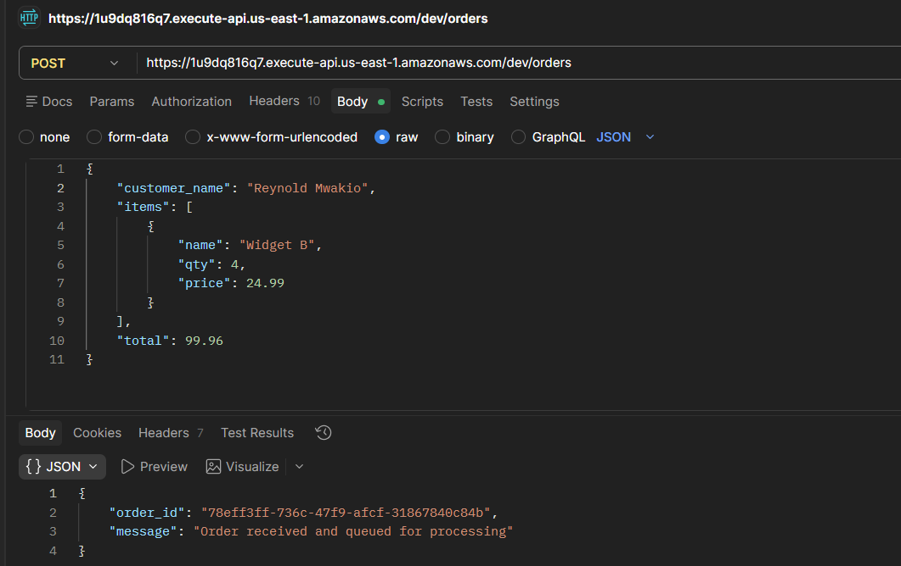
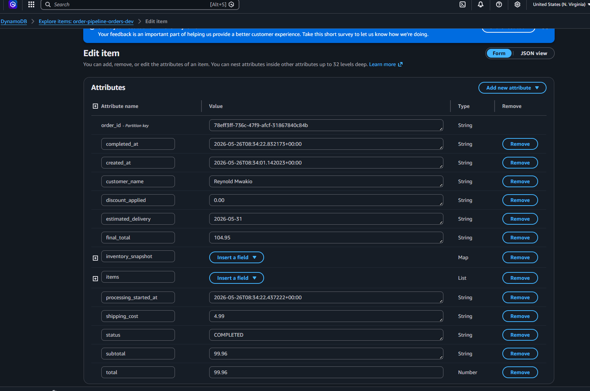
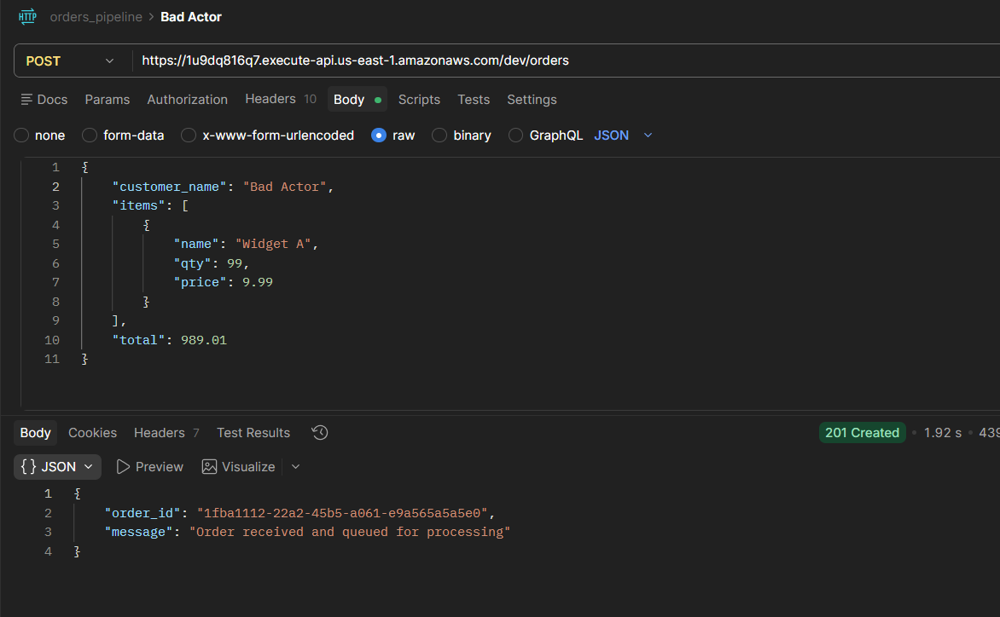
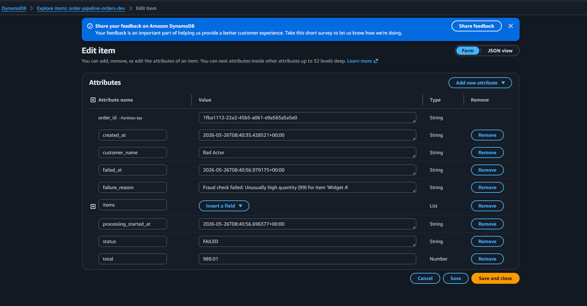

# Order Pipeline - Phase 2

> **Stack:** API Gateway → Lambda (intake) → SQS → Lambda (processor) → DynamoDB (orders + inventory)
> ALB → ASG (2× EC2 t3.micro, multi-AZ)

---

## Architecture

```
Customer
   │
   ▼
API Gateway  ──►  Lambda (order_intake)
                        │
                  ┌─────┴──────────────┐
                  ▼                    ▼
              DynamoDB             SQS Queue
           (status: PENDING)           │
                                       ▼
                               Lambda (order_processor)
                                       │
                         ┌─────────────┼─────────────┐
                         ▼             ▼             ▼
                   Fraud Check   Inventory     Total Verify
                                  DynamoDB
                                       │
                                  ┌────┴────┐
                                  ▼         ▼
                             Discounts   Shipping
                                  │
                                  ▼
                            DynamoDB update
                         (status: COMPLETED)
                         final_total, discount,
                         shipping, ETA written back
                                       │
                            on 3 failures ▼
                               Dead-Letter Queue (DLQ)

Internet ──► ALB ──► EC2 (AZ-a)
              └────► EC2 (AZ-b)    ← ASG desired=2, max=4
```

---

## Prerequisites

| Tool | Install |
|------|---------|
| Terraform ≥ 1.5 | https://developer.hashicorp.com/terraform/install |
| AWS CLI v2 | https://docs.aws.amazon.com/cli/latest/userguide/install-cliv2.html |
| Python 3.12 | https://www.python.org/downloads/ |

Configure AWS credentials:
```bash
aws configure
# Access Key ID, Secret Key, region: us-east-1, output: json
```

---

## Project Structure

```
order-pipeline/
├── main.tf                        # Root - wires all modules
├── variables.tf
├── outputs.tf
├── modules/
│   ├── dynamodb/                  # Orders table + Inventory table + seed data
│   ├── sqs/                       # Orders queue + Dead-Letter Queue
│   ├── lambda/                    # order_intake function + IAM
│   ├── lambda_processor/          # order_processor function + SQS trigger + IAM
│   ├── api_gateway/               # REST API, POST /orders
│   ├── alb/                       # Application Load Balancer
│   └── asg/                       # Auto Scaling Group, 2 EC2 replicas
└── lambdas/
    ├── order_intake/
    │   └── handler.py             # Validates → DynamoDB → publishes to SQS
    └── order_processor/
        └── handler.py             # 8-step business logic pipeline
```

---

## Deploy

```powershell
# First time
terraform init

# Preview (nothing created yet)
terraform plan

# Deploy
terraform apply
```

After apply, Terraform prints your endpoints:
```
api_endpoint               = "https://1u9dq816q7.execute-api.us-east-1.amazonaws.com/dev/orders"
alb_endpoint               = "http://order-pipeline-dev-alb-421855079.us-east-1.elb.amazonaws.com"
sqs_queue_url              = "https://sqs.us-east-1.amazonaws.com/688933602116/order-pipeline-orders-dev"
dlq_url                    = "https://sqs.us-east-1.amazonaws.com/xxxx/order-pipeline-orders-dev-dlq"
lambda_intake_log_group    = "/aws/lambda/order-pipeline-order-intake-dev"
lambda_processor_log_group = "/aws/lambda/order-pipeline-order-processor-dev"
```

---

## Inventory (pre-seeded on apply)

| Item      | Stock | Price  |
|-----------|-------|--------|
| Widget A  | 100   | $9.99  |
| Widget B  | 50    | $24.99 |
| Gadget X  | 30    | $49.99 |
| Gadget Y  | 20    | $99.99 |
| Doohickey | 200   | $4.99  |

---

## Test

### 1 - Basic order (triggers discount + shipping)
```powershell
$API="https://1u9dq816q7.execute-api.us-east-1.amazonaws.com/dev/orders"

curl -X POST $API `
  -H "Content-Type: application/json" `
  -d '{"customer_name":"Reynold Mwakio","items":[{"name":"Widget B","qty":4,"price":24.99}],"total":99.96}'
```

Expected response:
```json
{ "order_id": "uuid-here", "message": "Order received and queued for processing" }
```

### 2 - Free shipping threshold ($100+)
```powershell
curl -X POST $API `
  -H "Content-Type: application/json" `
  -d '{"customer_name":"Reynold Mwakio","items":[{"name":"Gadget Y","qty":2,"price":99.99}],"total":199.98}'
```

### 3 - Bundle discount (3+ distinct items)
```powershell
curl -X POST $API `
  -H "Content-Type: application/json" `
  -d '{
    "customer_name": "Reynold Mwakio",
    "items": [
      {"name":"Widget A","qty":1,"price":9.99},
      {"name":"Gadget X","qty":1,"price":49.99},
      {"name":"Doohickey","qty":2,"price":4.99}
    ],
    "total": 69.96
  }'
```

### 4 - Trigger fraud detection (qty > 50)
```powershell
curl -X POST $API `
  -H "Content-Type: application/json" `
  -d '{"customer_name":"Bad Actor","items":[{"name":"Widget A","qty":99,"price":9.99}],"total":989.01}'
```
Order will be saved as status `FAILED` with `failure_reason` in DynamoDB.

### 5 - Trigger total mismatch (price tampering)
```powershell
curl -X POST $API `
  -H "Content-Type: application/json" `
  -d '{"customer_name":"Hacker","items":[{"name":"Gadget Y","qty":1,"price":99.99}],"total":1.00}'
```

### 6 - ALB health check
```powershell
curl "http://order-pipeline-dev-alb-421855079.us-east-1.elb.amazonaws.com/health"
# {"status": "ok"}
```

---

## Watch logs in real time

Open two terminals after posting an order:

```powershell
# Terminal 1 — intake Lambda
aws logs tail /aws/lambda/order-pipeline-order-intake-dev --follow

# Terminal 2 — processor Lambda
aws logs tail /aws/lambda/order-pipeline-order-processor-dev --follow
```

---

## Verify enriched order in DynamoDB

```powershell
aws dynamodb scan --table-name order-pipeline-orders-dev --region us-east-1
```

A completed order will have these extra fields written by the processor:
```json
{
  "status":            "COMPLETED",
  "subtotal":          "99.96",
  "discount_applied":  "4.99",
  "shipping_cost":     "4.99",
  "final_total":       "99.96",
  "estimated_delivery": "2026-05-30",
  "completed_at":      "2026-05-25T22:00:00+00:00"
}
```

---

## Business Logic Reference

| Rule | Behaviour |
|------|-----------|
| Fraud: qty > 50 | Order → FAILED |
| Fraud: total > $10,000 | Order → FAILED |
| Fraud: price ≤ 0 | Order → FAILED |
| Out of stock | Order → FAILED |
| Total mismatch > $0.02 | Order → FAILED |
| Subtotal ≥ $500 | 15% discount |
| Subtotal ≥ $250 | 10% discount |
| Subtotal ≥ $100 | 5% discount |
| 3+ distinct items | Extra $5 bundle discount |
| Discounted total ≥ $100 | Free shipping |
| Discounted total ≥ $50 | $4.99 shipping |
| Discounted total < $50 | $8.99 shipping |
| SQS delivery failure × 3 | Message → DLQ |

---

## Results

### Successful Order - DynamoDB enriched record



### Fraud Detection - Bad Actor blocked



---

## Tear Down

```powershell
terraform destroy
```

Your code files stay intact. Re-deploy anytime with `terraform apply`.

---

## What's Next - Phase 3

- **SNS + SES** - send real email confirmations on COMPLETED orders
- **CloudWatch Alarms** - alert when DLQ receives messages (processing failures)
- **Step Functions** - replace Lambda-to-Lambda chaining with a visual state machine
