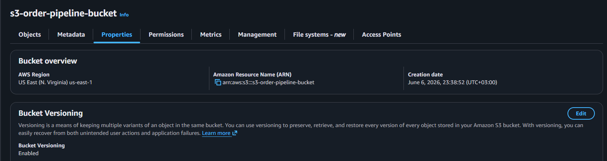
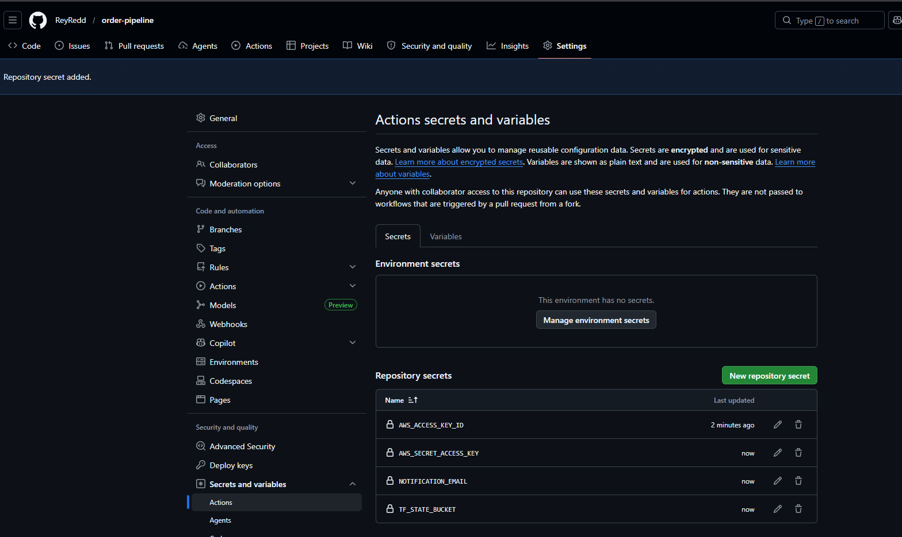
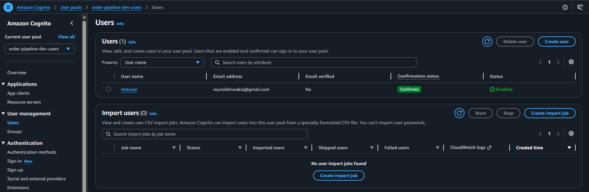
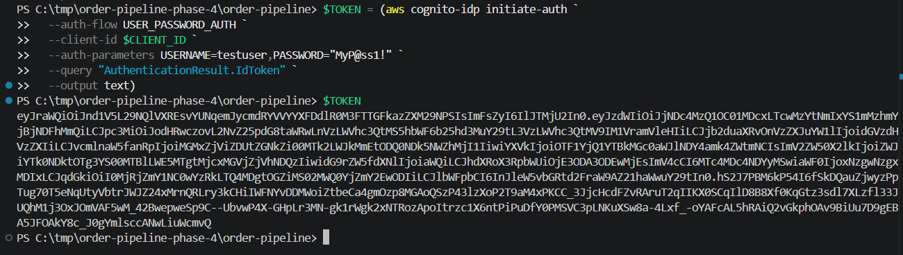
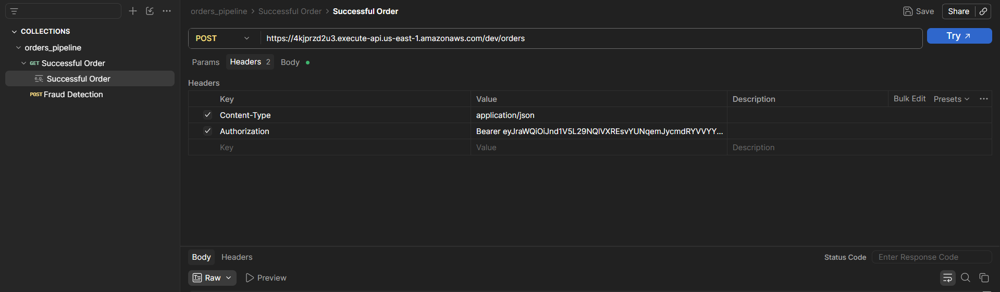
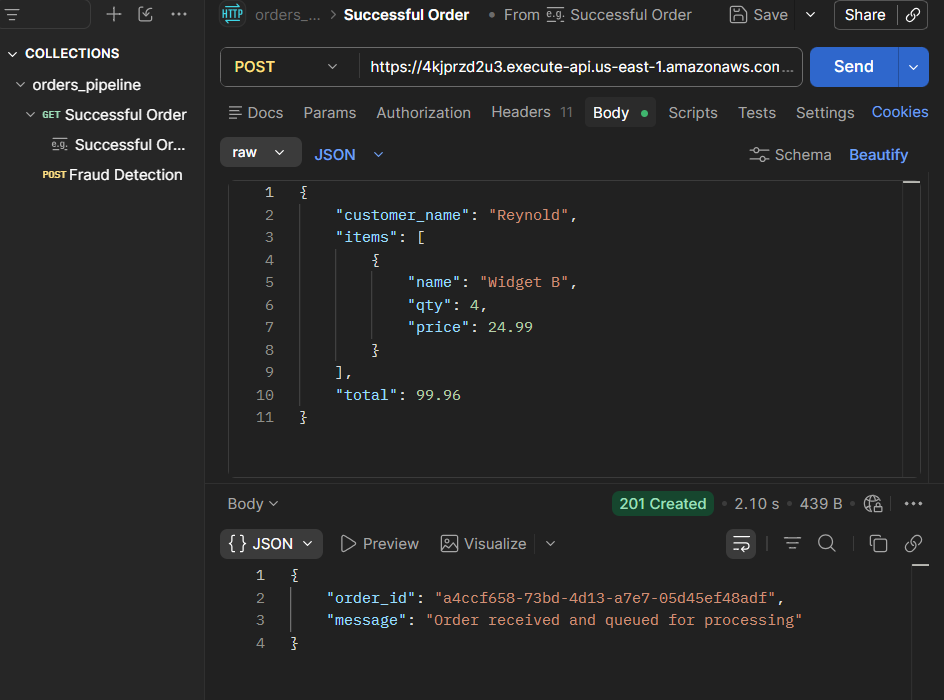
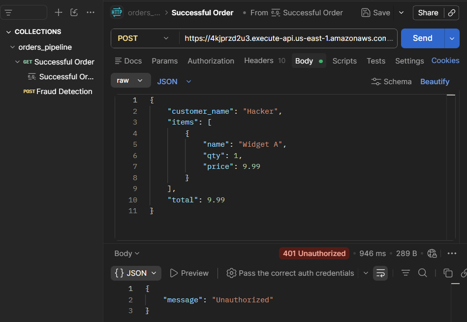
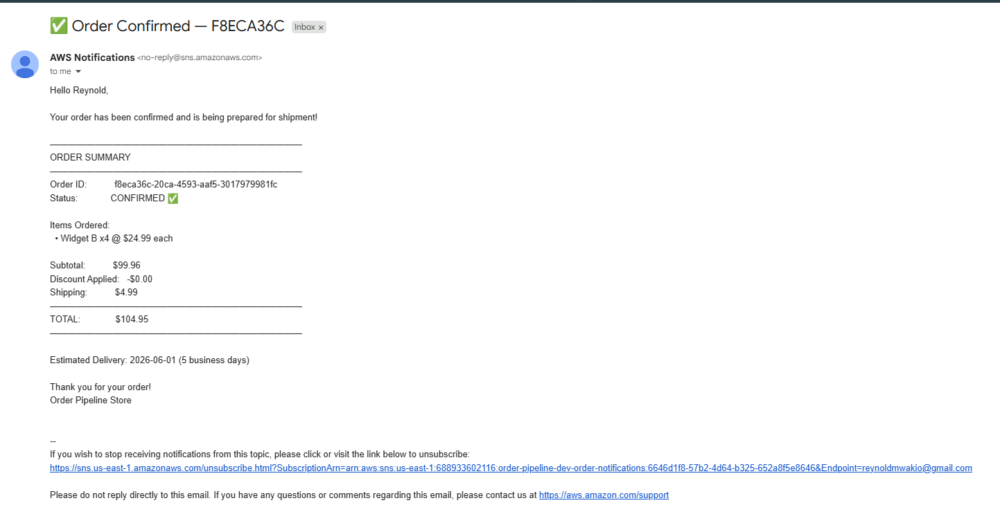

# Order Pipeline - Phase 4

> **Stack:** Cognito JWT auth + API Gateway + Lambda + SQS + Step Functions (Express) + DynamoDB + SNS + CloudWatch + ALB + ASG
> **CI/CD:** GitHub Actions deploys on every push to `main`

---

## Architecture

```
User → aws cognito initiate-auth → JWT token
                 │
                 ▼
API Gateway (validates JWT via Cognito authorizer)
                 │
                 ▼
Lambda (order_intake) → DynamoDB (PENDING) + SQS
                                               │
                                               ▼
                                   Lambda (orchestrator)
                                               │
                                               ▼
                              Step Functions Express Workflow
                         ┌─────────────────────────────────────┐
                         │  1. ValidateOrder                    │
                         │     └── fraud detection              │
                         │     └── total verification           │
                         │  2. CheckInventory                   │
                         │     └── stock availability check     │
                         │  3. CalculatePricing                 │
                         │     └── discount engine              │
                         │     └── shipping calculator          │
                         │  4. FulfillOrder                     │
                         │     └── commit inventory             │
                         │     └── DynamoDB → COMPLETED         │
                         │     └── SNS confirmation email       │
                         │  ↘ HandleFailure (any error)         │
                         │     └── DynamoDB → FAILED            │
                         │     └── SNS failure email            │
                         └─────────────────────────────────────┘

GitHub Actions (push to main):
  checkout → configure AWS → terraform init → plan → apply
```

---

## CI/CD Setup (do this once)

### 1 - Create S3 bucket for remote state

```powershell
aws s3api create-bucket --bucket <your-unique-bucket-name> --region us-east-1
aws s3api put-bucket-versioning --bucket <your-unique-bucket-name> --versioning-configuration Status=Enabled
```


### 2 - Add GitHub Secrets

Go to: **GitHub repo → Settings → Secrets and variables → Actions → New secret**

| Secret | Value |
|--------|-------|
| `AWS_ACCESS_KEY_ID` | Your IAM access key |
| `AWS_SECRET_ACCESS_KEY` | Your IAM secret key |
| `TF_STATE_BUCKET` | S3 bucket name from step 1 |
| `NOTIFICATION_EMAIL` | Your email for SNS notifications |



### 3 - Push to main

```powershell
git add .
git commit -m "feat: phase 4 - Cognito + Step Functions + CI/CD"
git push origin main
```

GitHub Actions deploys automatically. Watch it under **Actions** tab.

---

## Local Deploy

```powershell
# Init with S3 backend
terraform init `
  -backend-config="bucket=<your-bucket>" `
  -backend-config="key=order-pipeline/dev/terraform.tfstate" `
  -backend-config="region=us-east-1" `
  -backend-config="encrypt=true"

terraform apply -var="notification_email=your@email.com"
```

---

## Test with Cognito Auth

### Step 1 - Create a test user

```powershell
$POOL_ID = "<cognito_user_pool_id from terraform output>"
$CLIENT_ID = "<cognito_client_id from terraform output>"

aws cognito-idp admin-create-user `
  --user-pool-id $POOL_ID `
  --username testuser `
  --temporary-password "TempPass1!" `
  --user-attributes Name=email,Value=your@email.com

aws cognito-idp admin-set-user-password `
  --user-pool-id $POOL_ID `
  --username testuser `
  --password "MyPass1!" `
  --permanent
```



### Step 2 - Get JWT token

```powershell
$TOKEN = (aws cognito-idp initiate-auth `
  --auth-flow USER_PASSWORD_AUTH `
  --client-id $CLIENT_ID `
  --auth-parameters USERNAME=testuser,PASSWORD="MyPass1!" `
  --query "AuthenticationResult.IdToken" `
  --output text)
```



### Step 3 - Place an authenticated order

```powershell
$API="<api_endpoint from terraform output>"

curl -X POST $API `
  -H "Content-Type: application/json" `
  -H "Authorization: Bearer $TOKEN" `
  -d '{"customer_name":"Reynold","items":[{"name":"Widget B","qty":4,"price":24.99}],"total":99.96}'
```


### Without a token - should return 401

```powershell
curl -X POST $API `
  -H "Content-Type: application/json" `
  -d '{"customer_name":"Hacker","items":[{"name":"Widget A","qty":1,"price":9.99}],"total":9.99}'
```

---

## Watch Step Functions executions

```powershell
# List recent executions
aws stepfunctions list-executions `
  --state-machine-arn "<state_machine_arn from terraform output>" `
  --max-results 5

# View execution details
aws stepfunctions describe-execution `
  --execution-arn "<execution arn from above>"
```

Or visit: **AWS Console → Step Functions → order-pipeline-dev-order-processor**

---

## Tear Down

```powershell
terraform destroy
```

---

## Phase Summary

| Phase | What was built |
|-------|----------------|
| 1 | API Gateway + Lambda + DynamoDB |
| 2 | + SQS + DLQ + real business logic |
| 3 | + SNS emails + CloudWatch alarms + dashboard |
| 4 | + Cognito JWT auth + Step Functions + GitHub Actions CI/CD |

## Results

### Successful Order - DynamoDB enriched record

---------


### Fraud Detection - Bad Actor blocked


<!-- ### Order Confirmation Email
 -->