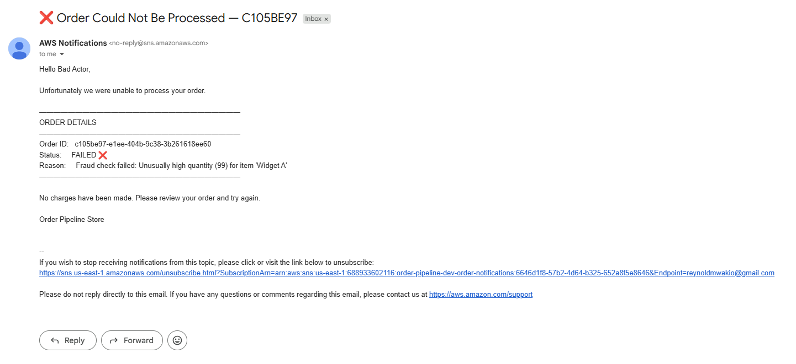

# Order Pipeline - Phase 3

> **Stack:** API Gateway → Lambda → SQS → Lambda → DynamoDB + SNS email notifications + CloudWatch alarms & dashboard
> ALB → ASG (2× EC2 t3.micro, multi-AZ)

---

## Architecture

```
Customer
   │
   ▼
API Gateway ──► Lambda (order_intake) ──► DynamoDB (PENDING)
                        │
                        ▼
                    SQS Queue
                        │
                        ▼
               Lambda (order_processor)
                        │
          ┌─────────────┼──────────────┐
          ▼             ▼              ▼
    Fraud Check   Inventory DB   Total Verify
                        │
                 Discount + Shipping
                        │
                 DynamoDB (COMPLETED/FAILED)
                        │
                        ▼
                    SNS Topic
                        │
              ┌─────────┴──────────┐
              ▼                    ▼
        Customer Email         Ops Alerts
    "Order Confirmed ✅"    CloudWatch Alarms
    "Order Failed ❌"

CloudWatch Alarms → SNS (Ops):
  ├── DLQ depth > 0
  ├── Lambda errors > 0
  ├── ALB 5xx > 5
  └── Order rate spike > 100/min

Internet ──► ALB ──► EC2 (AZ-a)
              └────► EC2 (AZ-b)   ← ASG desired=2, max=4
```

---

## Prerequisites

| Tool | Install |
|------|---------|
| Terraform ≥ 1.5 | https://developer.hashicorp.com/terraform/install |
| AWS CLI v2 | https://docs.aws.amazon.com/cli/latest/userguide/install-cliv2.html |
| Python 3.12 | https://www.python.org/downloads/ |

---

## Project Structure

```
order-pipeline/
├── main.tf
├── variables.tf               ← set notification_email here
├── outputs.tf
├── modules/
│   ├── dynamodb/              # orders + inventory tables
│   ├── sqs/                   # queue + DLQ
│   ├── sns/                   # order notifications + ops alerts topics
│   ├── lambda/                # order_intake
│   ├── lambda_processor/      # order_processor + SQS trigger
│   ├── api_gateway/
│   ├── alb/
│   ├── asg/
│   └── cloudwatch/            # 5 alarms + dashboard
└── lambdas/
    ├── order_intake/handler.py
    └── order_processor/handler.py
```

---

## ⚠️ Before You Deploy - Set Your Email

Open `variables.tf` and update:

```hcl
variable "notification_email" {
  default = "your-email@gmail.com"   # ← change this
}
```

---

## Deploy

```powershell
terraform init
terraform plan
terraform apply
```

### After apply - confirm your email subscription
AWS SNS sends a confirmation email to your address immediately after apply.
**You must click "Confirm subscription"** in that email before notifications will work.

---

## Test

```powershell
$API="https://xxxx.execute-api.us-east-1.amazonaws.com/dev/orders"
```

### Happy path - triggers email confirmation
```powershell
curl -X POST $API `
  -H "Content-Type: application/json" `
  -d '{"customer_name":"Reynold","items":[{"name":"Widget B","qty":4,"price":24.99}],"total":99.96}'
```
→ Check your inbox for **"✅ Order Confirmed"** email

### Fraud trigger — triggers failure email
```powershell
curl -X POST $API `
  -H "Content-Type: application/json" `
  -d '{"customer_name":"Bad Actor","items":[{"name":"Widget A","qty":99,"price":9.99}],"total":989.01}'
```
→ Check your inbox for **"❌ Order Could Not Be Processed"** email

### Bundle discount + free shipping
```powershell
curl -X POST $API `
  -H "Content-Type: application/json" `
  -d '{
    "customer_name":"Reynold",
    "items":[
      {"name":"Widget A","qty":1,"price":9.99},
      {"name":"Gadget X","qty":1,"price":49.99},
      {"name":"Gadget Y","qty":1,"price":99.99}
    ],
    "total":159.97
  }'
```
→ 5% discount + $5 bundle discount + free shipping applied

---

## Watch logs live

```powershell
# Terminal 1 - intake
aws logs tail /aws/lambda/order-pipeline-order-intake-dev --follow

# Terminal 2 - processor
aws logs tail /aws/lambda/order-pipeline-order-processor-dev --follow
```

---

## CloudWatch Dashboard

After apply, open the dashboard URL from terraform outputs:
```
cloudwatch_dashboard = "https://console.aws.amazon.com/cloudwatch/home#dashboards:name=..."
```

Panels:
- Order intake Lambda invocations
- Processor errors & duration
- SQS queue depth & DLQ depth
- ALB request count & 5xx errors

---

## Alarm Thresholds (customisable in variables.tf)

| Alarm | Default Threshold |
|-------|-------------------|
| DLQ messages | > 0 |
| Lambda errors | > 0 |
| ALB 5xx errors | > 5 per minute |
| High order rate | > 100 invocations per minute |
| Processor slow | avg duration > 20s |

---

## Business Logic Reference

| Rule | Behaviour |
|------|-----------|
| Fraud: qty > 50 | FAILED + email |
| Fraud: total > $10,000 | FAILED + email |
| Out of stock | FAILED + email |
| Total mismatch > $0.02 | FAILED + email |
| Subtotal ≥ $500 | 15% discount |
| Subtotal ≥ $250 | 10% discount |
| Subtotal ≥ $100 | 5% discount |
| 3+ distinct items | Extra $5 bundle discount |
| Discounted total ≥ $100 | Free shipping (3 days) |
| Discounted total ≥ $50 | $4.99 shipping (5 days) |
| Discounted total < $50 | $8.99 shipping (7 days) |
| SQS failure × 3 | Message → DLQ + ops alert |

---

## Results

### Successful Order - DynamoDB enriched record


### Fraud Detection - Bad Actor blocked




---

## Tear Down

```powershell
terraform destroy
```

---

## What's Next - Phase 4

- **Step Functions** - replace Lambda chaining with a visual state machine
- **Cognito** - add JWT authentication to API Gateway
- **CI/CD** - GitHub Actions pipeline to auto-deploy on push
